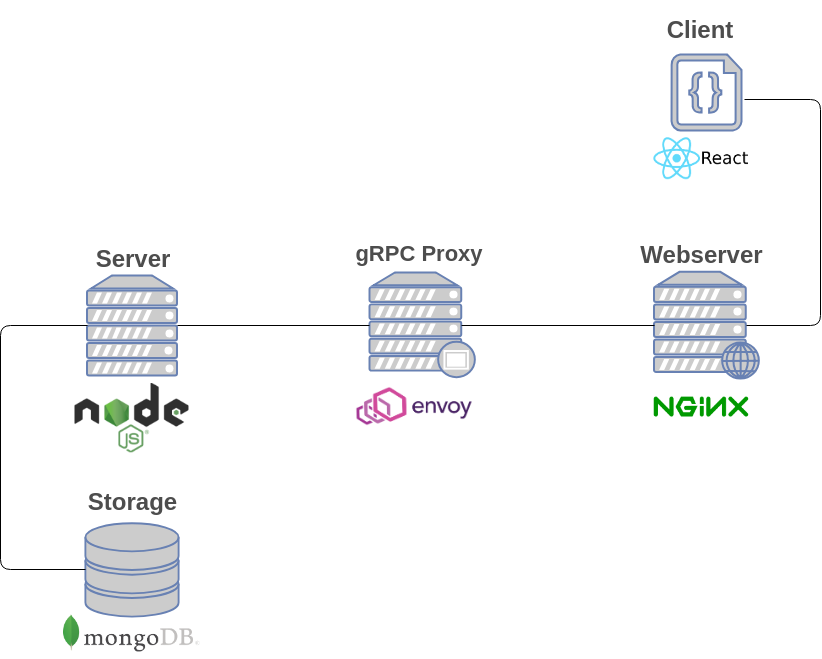

# todo-manager

> A simple full stack webapp with gRPC

## Technologies


- MongoDB
- gRPC Node.js backend
- Envoy 
- Nginx
- React

## gRPC

- server is using the `grpc` npm package 
- client is using the `grpc-web-client` npm package
- protocol stubs generated using `protoc` with the `ts-protoc-gen` npm package


### todo.proto 
```
syntax = "proto3";

package todo;

message Empty {}

message Todo {
    required int32 id = 1; 
    required string title = 2;
    optional string body = 3;
}

message TodoIdRequest {
    int32 id = 1;
}

message TodoList {
    repeated Todo todos = 1;
}

service TodoService {
    rpc GetTodo (TodoIdRequest) returns (Todo)  {}
    rpc ListTodos (Empty) returns (TodoList) {}
    rpc InsertTodo (Todo) returns (Empty) {}
    rpc DeleteTodo (TodoIdRequest) returns (Empty) {}
}
```


## Getting started

Clone the repository

`git clone https://github.com/KaindlJulian/todo-manager.git`


Run the containers with docker-compose

`docker-compose build`
`docker-compose up`

The webapp is running on localhost:80 
